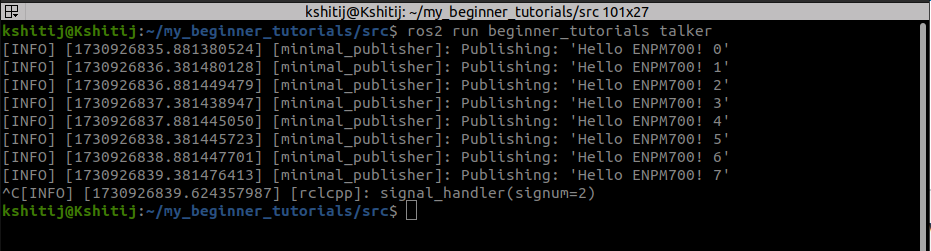

# my_beginner_tutorials
Kshitij Aggarwal

119211618

# Overview:

A basic ROS2 package that has a publisher with a custom message "Hello ENPM700!".

# Build instructions

1. Create a workspace, with the package in the src/
2. Move to the base of the workspace.
3. Check for dependencies: rosdep install -i --from-path src --rosdistro humble -y
4. Build the package: colcon build --packages-select beginner_tutorials

# Run instructions:
1. Source setup files: . install/setup.bash
2. Run the publisher node: ros2 run beginner_tutorials talker

# Launch instruction:
1. Run the command: ros2 launch beginner_tutorials chitchat.launch.py 

arguments:

a. publish_freq - For dynamically changing the frequency of the talker node.
b. enable_rosbag - For enabling/disabling rosbag recording from the launch file.

example: ros2 launch beginner_tutorials chitchat.launch.py enable_rosbag:=ture

NOTE: The default publishing frequency is 1. However, by passing the parameter `publish_freq`, that can be changed. 

This launch file will launch the talker, listener, and the rosbag node together.

Bag recorder is disabled by default. Pass the argument as "true" to enable it. 

# Service call instructions:
1. Open another terminal in the root of the workspace
2. Source local setup: source install/setup.bash
3. Run the command:  ros2 service call /set_message beginner_tutorials/srv/SetString "{data: 'New message here.'}"

Note: If an empty message is passed, the node will generate an ERROR log message and it will revert back to the current running message.

# Catch2 test results:

To run the tests: colcon test  --return-code-on-test-failure --event-handlers console_cohesion+ --packages-select beginner_tutorials
echo ?

NOTE: The test case checks if the 'talker' node is able to publish to the correct topic or not.

# Record and play ROSBAG:

To execute the ros_bag recorder, simply pass the argument "enable_rosbag" as "true".

To replay the rosbag, run: ros2 bag play my_bag

To check the output, open another terminal and run the listener node:

ros2 run beginner_tutorials listener

# RESULTS:

